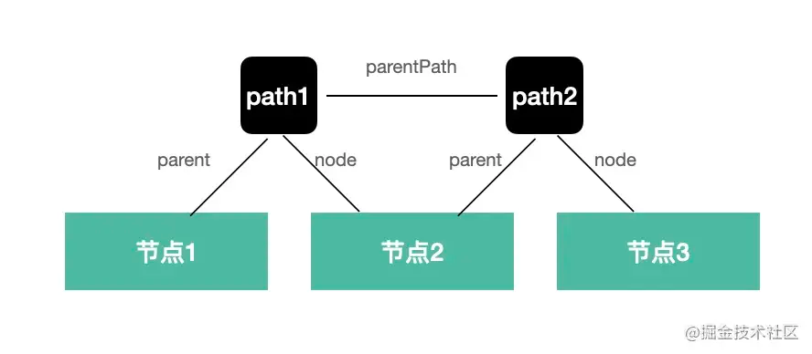
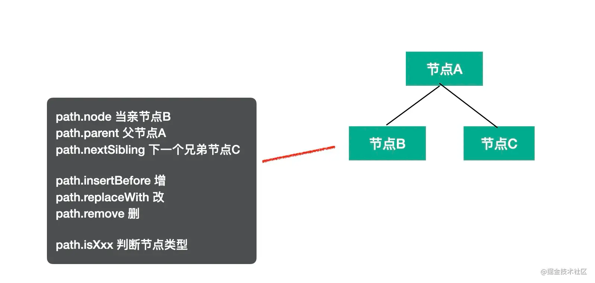
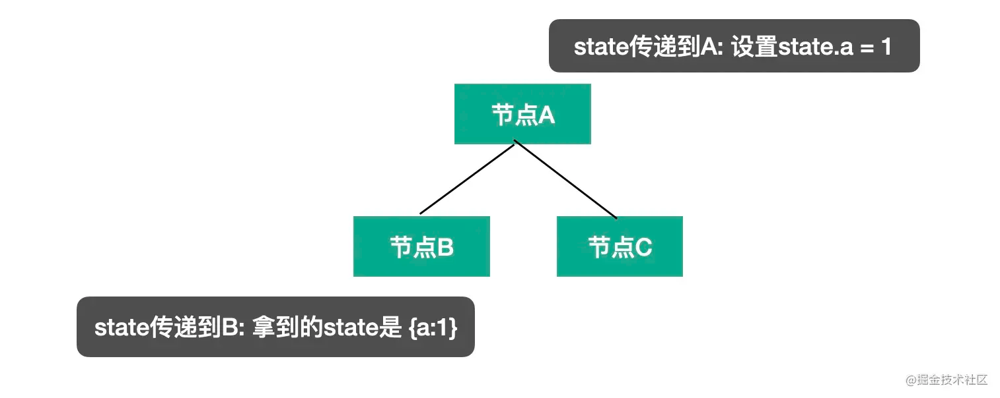

# path

path 是遍历过程中的路径，会保留上下文信息，有很多属性和方法，比如:

* path.node 指向当前 AST 节点
* path.get、path.set 获取和设置当前节点属性的 path
* path.parent 指向父级 AST 节点
* path.getSibling、path.getNextSibling、path.getPrevSibling 获取兄弟节点
* path.find 从当前节点向上查找节点

这些属性和方法是获取当前节点以及它的关联节点的

* path.scope 获取当前节点的作用域信息

这个属性可以获取作用域的信息

* path.isXxx 判断当前节点是不是 xx 类型
* path.assertXxx 判断当前节点是不是 xx 类型，不是则抛出异常

isXxx、assertXxx 系列方法可以用于判断 AST 类型

* path.insertBefore、path.insertAfter 插入节点
* path.replaceWith、path.replaceWithMultiple、replaceWithSourceString 替换节点
* path.remove 删除节点

这些方法可以对 AST 进行增删改

* path.skip 跳过当前节点的子节点的遍历
* path.stop 结束后续遍历

# state

第二个参数 state 则是遍历过程中在不同节点之间传递数据的机制，插件会通过 state 传递 options 和 file 信息，我们也可以通过 state 存储一些遍历过程中的共享数据。

