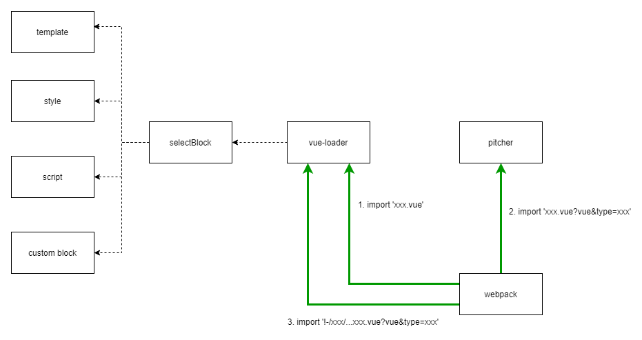

# uni-template-compiler 分享

## 1 webpack loader 和 Plugin 的区别

> loader 用于转换某些类型的模块，而插件则可以用于执行范围更广的任务。包括：打包优化，资源管理，注入环境变量。

### 1.1 loader

用于对模块源码的转换：
loader描述了webpack如何处理非javascript模块，并且在buld中引入这些依赖。
loader可以将文件从不同的语言（如TypeScript）转换为JavaScript，或者将内联图像转换为data URL。比如说：vue-loader，css-loader，style-loader等

> 在一亩田小程序的全埋点方案和weex代码兼容层中，就使用了 loader 的方式，对 vue-loader 处理后的 template 部分和 script 部分做了修改。

### 1.2 Plugin

目的在于解决loader无法实现的其他事，
从打包优化和压缩，到重新定义环境变量，功能强大到可以用来处理各种各样的任务。

## 2 loader 的不同加载方式


### 2.1 配置方式
在 webpack.config.js 文件中指定 loader.

```js
module.exports = {
  module: {
    rules: [
      {
        test: /\.css$/,
        use: [
          { loader: 'style-loader' },
          {
            loader: 'css-loader',
            options: {
              modules: true
            }
          },
        ]
      }, 
      {
        resourceQuery: /vue&type=script/, // test: /\.css$/,
        loader: "ymt-scripter",
      }
    ]
  }
};
```
2.1.2 内联方式
可以在 import 语句或任何 与 "import" 方法同等的引用方式 中指定 loader。使用 ! 将资源中的 loader 分开。每个部分都会相对于当前目录解析。

通过为内联 import 语句添加前缀，可以覆盖 配置 中的所有 loader, preLoader 和 postLoader：

1. 使用 ! 前缀，将禁用所有已配置的 normal loader(普通 loader)
   > import Styles from '!style-loader!css-loader?modules!./styles.css';
2. 使用 !! 前缀，将禁用所有已配置的 loader（preLoader, loader, postLoader）
   > import Styles from '!!style-loader!css-loader?modules!./styles.css';
3. 使用 -! 前缀，将禁用所有已配置的 preLoader 和 loader，但是不禁用 postLoaders
   > import Styles from '-!style-loader!css-loader?modules!./styles.css';

选项可以传递查询参数，例如 ?key=value&foo=bar，或者一个 JSON 对象，例如 ?{"key":"value","foo":"bar"}。

### 2.2 loader 特性

1. loader 支持链式调用。链中的每个 loader 会将转换应用在已处理过的资源上。一组链式的 loader 将按照相反的顺序执行。链中的第一个 loader 将其结果（也就是应用过转换后的资源）传递给下一个 loader，依此类推。最后，链中的最后一个 loader，返回 webpack 所期望的 JavaScript。
2. loader 可以是同步的，也可以是异步的。
3. loader 运行在 Node.js 中，并且能够执行任何操作。
4. loader 可以通过 options 对象配置（仍然支持使用 query 参数来设置选项，但是这种方式已被废弃）。
5. 除了常见的通过 package.json 的 main 来将一个 npm 模块导出为 loader，还可以在 module.rules 中使用 loader 字段直接引用一个模块。
6. 插件(plugin)可以为 loader 带来更多特性。
7. loader 能够产生额外的任意文件。

## 3 vue-loader

如果将 vue-loader 单独拿到 webpack.config 配置的话，它应该这么写，分为 loader 和 plugin 2个部分
```js
const VueLoaderPlugin = require("vue-loader/lib/plugin");

module.exports = {
    module: {
        rules: [
            {
                test: /.vue$/,
                use: [{ loader: "vue-loader" }],
            }
        ],
    },
    plugins: [
        new VueLoaderPlugin()
    ],
};
```

运行过程可以粗略总结为两个阶段：

1. 预处理阶段：在插件 apply 函数动态修改 webpack 配置，注入 vue-loader 专用的 rules
2. 内容处理阶段：vue-loader 配合 pitcher-loader 完成文件内容转换

### 3.1 插件预处理阶段

vue-loader 插件会在apply函数中扩展webpack配置信息核心代码如下：

```js
class VueLoaderPlugin {
  apply (compiler) {
    // ...

    const rules = compiler.options.module.rules
    // ...

    const clonedRules = rules
      .filter(r => r !== rawVueRules)
      .map((rawRule) => cloneRule(rawRule, refs))

    // ...

    // global pitcher (responsible for injecting template compiler loader & CSS
    // post loader)
    const pitcher = {
      loader: require.resolve('./loaders/pitcher'),
      resourceQuery: query => {
        if (!query) { return false }
        const parsed = qs.parse(query.slice(1))
        return parsed.vue != null
      }
      // ...
    }

    // replace original rules
    compiler.options.module.rules = [
      pitcher,
      ...clonedRules,
      ...rules
    ]
  }
}

function cloneRule (rawRule, refs) {
    // ...
}

module.exports = VueLoaderPlugin
```

主要执行了2个任务
1. 初始化 pitcher
2. 复制 rules 列表并将 pitcher loader 添加到 module 中

其中 cloneRule 内部定义的 resourceQuery 函数对应 [module.rules.resourceQuery](https://webpack.docschina.org/configuration/module/#ruleresourcequery) 配置项，与我们经常用的 test 差不多，都用于判断资源路径是否适用这个rule。
这里 resourceQuery 核心逻辑就是取出路径中的lang参数，伪造一个以 lang 结尾的路径，传入rule的condition中测试路径名对该rule是否生效，例如下面这种会命中 /.js$/i 规则：

go
匹配这种规则
```js
import script from "./index.vue?vue&type=script&lang=js&"
```
这样为不同内容块 (css/js/template) 匹配用户定义的 rule

### 3.2 内容处理阶段

插件处理完配置，webpack 运行起来之后，vue SFC 文件会被多次传入不同的loader，经历多次中间形态变换之后才产出最终的js结果，大致上可以分为如下步骤：

1. 路径命中 /.vue$/i 规则，调用 vue-loader 生成中间结果A
2. 结果A命中 xx.vue?vue 规则，调用 vue-loader pitcher 生成中间结果B
3. 结果B命中具体loader，直接调用loader做处理



```js
// 原始代码
import xx from './index.vue';
// 第一步，命中 vue-loader，转换为：
import { render, staticRenderFns } from "./index.vue?vue&type=template&id=2964abc9&scoped=true&"
import script from "./index.vue?vue&type=script&lang=js&"
export * from "./index.vue?vue&type=script&lang=js&"
import style0 from "./index.vue?vue&type=style&index=0&id=2964abc9&scoped=true&lang=css&"

// 第二步，命中 pitcher，转换为：
export * from "-!../../node_modules/vue-loader/lib/loaders/templateLoader.js??vue-loader-options!../../node_modules/vue-loader/lib/index.js??vue-loader-options!./index.vue?vue&type=template&id=2964abc9&scoped=true&"
import mod from "-!../../node_modules/babel-loader/lib/index.js??clonedRuleSet-2[0].rules[0].use!../../node_modules/vue-loader/lib/index.js??vue-loader-options!./index.vue?vue&type=script&lang=js&"; 
export default mod; export * from "-!../../node_modules/babel-loader/lib/index.js??clonedRuleSet-2[0].rules[0].use!../../node_modules/vue-loader/lib/index.js??vue-loader-options!./index.vue?vue&type=script&lang=js&"
export * from "-!../../node_modules/mini-css-extract-plugin/dist/loader.js!../../node_modules/css-loader/dist/cjs.js!../../node_modules/vue-loader/lib/loaders/stylePostLoader.js!../../node_modules/vue-loader/lib/index.js??vue-loader-options!./index.vue?vue&type=style&index=0&id=2964abc9&scoped=true&lang=css&"
```

#### 3.2.1

.vue 文件
```html
<template>...</template>    
<script >...</script>
<style>...</style>
```

第一步将 使用 @vue/component-compiler-utils 传入的源码字符串解析4个部分：
```js
{
    template: {
        type: 'template',
        conent: '',
        start: 0,
        end: 646,
        attrs: {}
    },
    script: null,
    styles: [],
    customBlocks: [],
    errors: []
}
```

然后再将各个部分转为特殊的引用路径。变成这样
```js
import { render, staticRenderFns } from "./index.vue?vue&type=template&id=2964abc9&scoped=true&"
import script from "./index.vue?vue&type=script&lang=js&"
export * from "./index.vue?vue&type=script&lang=js&"
import style0 from "./index.vue?vue&type=style&index=0&id=2964abc9&scoped=true&lang=css&"


/* normalize component */
import normalizer from "!../../node_modules/vue-loader/lib/runtime/componentNormalizer.js"
var component = normalizer(
  script,
  render,
  staticRenderFns,
  false,
  null,
  "2964abc9",
  null
)
...
export default component.exports
```
这些路径都对应原始的 .vue 路径基础上增加了 vue 标志符及 type、lang 等参数。

### 3.2.2 执行 pitcher
```js
const pitcher = {
  loader: require.resolve('./loaders/pitcher'),
  resourceQuery: query => {
    if (!query) { return false }
    const parsed = qs.parse(query.slice(1))
    return parsed.vue != null
  }
}
```
当路径参数中存在vue时，就执行 pitcher loader

```js
// 开发代码：
import xx from 'index.vue'
// 第一步，通过vue-loader转换成带参数的路径
import script from "./index.vue?vue&type=script&lang=js&"
// 第二步，在 pitcher 中解读loader数组的配置，并将路径转换成完整的行内路径格式
import mod from "-!../../node_modules/babel-loader/lib/index.js??clonedRuleSet-2[0].rules[0].use!../../node_modules/vue-loader/lib/index.js??vue-loader-options!./index.vue?vue&type=script&lang=js&";
```
pitcher 会返回
<code>import mod from "..."</code>
形状的字符串

webpack再次流转时会解析code参数，并倒叙调用相关的插件，这里就会先调用 vue-loader，再调用 babel-loader。

再次执行vue-loader时因为携带了type参数会执行
```js
if (incomingQuery.type) {
    return selectBlock(
      descriptor,
      loaderContext,
      incomingQuery,
      !!options.appendExtension
    );
  }
```
这段代码。
然后调用 content 的callback 执行下面的流程。

一亩田小程序全埋点对 template 模板的处理

## 4 一亩田小程序全埋点对 template 模板的处理

### 4.1 加载 loader
```js
module.exports = {
   // ...
   configureWebpack: {
      resolveLoader: {
         modules: [
            "node_modules/@ymt/uni-loader-weex/lib",
            "node_modules/@ymt/uni-clickid-generator/lib",
         ],
      },
      module: {
         rules: [
             // ...
            {
               resourceQuery: /vue&type=template/,
               use: [
                  // ...
                  {
                     loader: "clickIdGenerator",
                     query: {
                        saKeyMappingPath: path.resolve("./", "./saKeyMapping.json"),
                     },
                  },
               ],
            }
         ],
      },
   },
   // ...
};
```

### 4.2 解析 template

使用 <code>htmlparser2</code> 库将 template 转化为ast

在遍历 ast 的过程中 根据元素的属性生成 saKeyMapping.json 中的 key，并将 key 添加到 元素的 data-name 属性上，再使用ast生成代码字符串返回
```html
<view data-name="1b"></view>
```
再配合神策的全埋点，点击时候会上报点击事件，并携带元素的data-name属性，这样就可以再神策后台筛选出来。

## 5 uni-app 对 template 的处理

主要的复杂的模板编译过程vue-loader已经做过了处理， uni-template-compiler 插件主要是做：
1. 内置组件的自动导入
2. 资源url和attr的
3. v-model 等api的支持，添加全局函数，用函数包裹我们自定义的函数和属性等等

在 vue-loader/lib/loaders/templateLoader.js 开始处理 template 内容的过程中，会使用到


