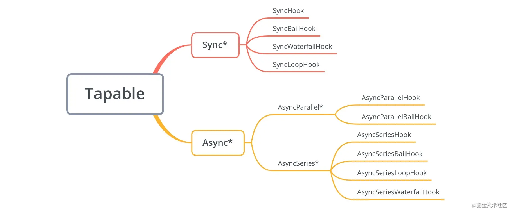

# webpack hook：Tapable

[https://github.com/webpack/tapable](https://github.com/webpack/tapable)

1
SyncHook
同步串行
不关心监听函数的返回值

2
SyncBailHook
同步串行
只要监听函数中有一个函数的返回值不为 undefined，则跳过剩下所有的逻辑

3
SyncWaterfallHook
同步串行
上一个监听函数的返回值可以传给下一个监听函数

4
SyncLoopHook
同步循环
当监听函数被触发的时候，如果该监听函数返回true时则这个监听函数会反复执行，如果返回 undefined 则表示退出循环

5
AsyncParallelHook
异步并发
不关心监听函数的返回值

6
AsyncParallelBailHook
异步并发
只要监听函数的返回值不为 null，就会忽略后面的监听函数执行，直接跳跃到callAsync等触发函数绑定的回调函数，然后执行这个被绑定的回调函数

7
AsyncSeriesHook
异步串行
不关心callback()的参数

8
AsyncSeriesBailHook
异步串行
callback()的参数不为null，就会直接执行callAsync等触发函数绑定的回调函数

9
AsyncSeriesWaterfallHook
异步串行
上一个监听函数的中的callback(err, data)的第二个参数,可以作为下一个监听函数的参数。

10
AsyncSeriesLoopHook
异步串行
可以触发handler循环调用。

作者：青舟同学
链接：https://juejin.cn/post/6844904004435050503
来源：稀土掘金
著作权归作者所有。商业转载请联系作者获得授权，非商业转载请注明出处。
